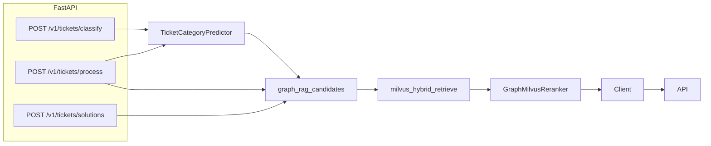

# FastAPI: wire existing components

There is **no HTTP layer today**. The assessment asks for “API endpoints for ticket processing and solution retrieval” with categories feeding retrieval. That pipeline already exists in notebooks; this work exposes it.

**Out of scope** (not existing code): anomaly detection, CatBoost/TensorFlow, subcategory models (no artifacts on disk), full 100k ingest-over-HTTP, retraining from feedback.



## Prerequisites (API cannot start without these)

[`src/classification/predictions.py`](src/classification/predictions.py) lines 92–110 and [`src/classification/model_training_category.py`](src/classification/model_training_category.py) lines 179–180 run training/undefined names **on import**. Guard both with `if __name__ == "__main__":` so `from src.classification.predictions import TicketCategoryPredictor` is safe.

The on-disk artifact [`trained_models/xgb_ticket_model_category.joblib`](trained_models/xgb_ticket_model_category.joblib) is a **dict bundle** (`model`, `label_encoder`, `ohe`, `embedder`, …), not a saved `TicketCategoryPredictor`. Add a small `load_category_predictor(path)` that builds `TicketFeaturizer` + `TicketCategoryPredictor` from that bundle.

[`src/rag/milvus_retrieve.py`](src/rag/milvus_retrieve.py) currently constructs a new `SentenceTransformer` on **every** query. Accept an optional embedder argument (app lifespan will inject one shared instance).

## App layout

Keep it flat under `src/api/` to match the existing `from src...` package:

- [`src/config.py`](src/config.py) (empty today) — `pydantic-settings` `Settings`: `milvus_uri`, `milvus_collection`, `model_path`, `graph_path`, `feedback_path`
- `src/api/schemas.py` — request/response models (do **not** reuse full [`Ticket`](src/schemas/ticket.py); that schema is historical resolved tickets with required `category`, `ticket_id`, timestamps, etc.)
- `src/api/state.py` — lifespan-loaded: predictor, NetworkX graph via `load_graph`, `MilvusClient`, shared MiniLM embedder, reranker
- `src/api/pipeline.py` — orchestration used by the process endpoint (classify → `GraphQuery` → `graph_rag_candidates` → `milvus_hybrid_retrieve` → `GraphMilvusReranker.rerank`)

**Shape mismatch to reconcile (in `pipeline.py`):** [`milvus_hybrid_retrieve`](src/rag/milvus_retrieve.py) returns *flat* dicts (entity fields merged into the row + `score`), but [`GraphMilvusReranker._extract_hit_fields`](src/rag/reranker.py) reads dict fields from a nested `entity` key. Passing retriever output straight into `rerank()` yields empty `fields` (null `ticket_id`, missing `resolution_code`/`category`). Fix in `pipeline.py` by wrapping each row as `{"score": row["score"], "entity": row}` before reranking, leaving `milvus_retrieve.py` and `reranker.py` untouched.
- `src/api/main.py` — FastAPI app, CORS off by default, routers, OpenAPI tags

Incoming body (fields the classifier already uses in [`prepare_classification_dataset`](src/classification/data_processing.py)):

```python
class IncomingTicket(BaseModel):
    subject: str
    description: str
    error_logs: str = ""
    product: str = ""
    product_module: str = ""
    priority: str = ""
    channel: str = ""
    customer_tier: str = ""
    subcategory: str | None = None  # optional client hint; not predicted
```

Subcategory is **not** predicted (only `xgb_ticket_model_category.joblib` exists). Graph issue-level priors need both category and subcategory; without a hint, retrieval still uses error-code graph priors + Milvus filtered by predicted category.

## Endpoints

| Method | Path | Behavior |
|--------|------|----------|
| GET | `/health` | Process up |
| GET | `/ready` | Model + graph loaded; Milvus `list_collections` (503 if not) |
| POST | `/v1/tickets/classify` | `predictor.predict([ticket])` → `{category, subcategory?}` |
| POST | `/v1/tickets/solutions` | Retrieval only; uses supplied or predicted category as metadata filter |
| POST | `/v1/tickets/process` | **Primary**: classify then retrieve/rerank (assessment “components build on each other”) |
| POST | `/v1/feedback` | Append JSONL (agent correction / `resolution_helpful` / satisfaction). No retrain. |

`POST /v1/tickets/process` response shape:

- `category` (predicted)
- `subcategory` (client hint or null)
- `solutions`: top-N reranked hits (`ticket_id`, `final_score`, `resolution_code`, `category`, `product`, `graph_prior`, `milvus_score`)
- `graph`: ranked `solution_nodes` + citation `ticket_nodes`

**Fallback** (assessment “fallback mechanisms”): if Milvus is down, return graph candidates only and set `degraded: true` rather than 500. Classifier/graph failure still 503.

Do **not** expose ingest of `support_tickets.json` over HTTP (100k records, minutes, already a `__main__` script).

## Build scripts (reproducible, non-notebook)

Today the build steps only exist as `__main__` blocks: [`graph_rag_ingest.py`](src/data/graph_rag_ingest.py) works, [`milvus_store.py`](src/rag/milvus_store.py) lines 210–230 has a **hardcoded absolute path** (`/home/ramesh/...`) and a `[:10000]` cap, and [`ingestion.py`](src/data/ingestion.py) only prints counts. Formalize as `scripts/` argparse CLIs; leave the library functions in `src/` as the reusable core the scripts call.

- `scripts/ingest.py` — validate `data/raw/support_tickets.json` via `load_tickets`, report valid/invalid counts (and duplicate stats, see below).
- `scripts/build_graph.py` — wrap `build_and_save_graph`; `--input`, `--output data/artifacts/support_graph.pkl`. **No dedup here** — the graph's issue→solution priors ([`top_solutions_for_issue`](src/data/graph_rag_query.py)) rely on counts/helpful-rates across all 110k rows, so it must see the full dataset.
- `scripts/build_milvus.py` — wrap `MilvusTicketStore`; `--uri`, `--collection`, `--limit 10000` (default kept), `--drop`. Fixes the hardcoded path. **Dedup before insert** (see below).

### Dedup for Milvus (the dataset is ~99% templated)

Measured on the real file (110,000 rows, all unique `ticket_id`):

- `(subject, description)` -> 350 unique
- cleaned `doc_text` (subject + description + [`clean_error_logs_preserve_codes`](src/classification/data_processing.py) on error_logs) -> **1,950 unique**
- raw `doc_text` (timestamps intact) -> 76,944 unique

Indexing 110k near-identical docs wastes space and pollutes hybrid retrieval. `build_milvus.py` will:

1. Compute a dedup key = cleaned `doc_text` (reuse `clean_error_logs_preserve_codes` so timestamp/ID noise doesn't defeat dedup; this is also exactly the text Milvus embeds via [`make_doc_text`](src/rag/milvus_store.py), minus the log noise).
2. Keep **one representative row per key**, preferring `resolution_helpful == True` then highest `satisfaction_score` (so the indexed resolution reflects a working fix), falling back to first seen.
3. Apply `--limit` **after** dedup (with ~1,950 unique, the default 10000 won't bind — full unique coverage by default; the flag stays for quick smoke runs).
4. Print `total -> unique -> inserted` so the reduction is visible/reproducible.

Dedup lives in the script (or a small helper in [`src/data/transforms.py`](src/data/transforms.py), currently empty), not inside `MilvusTicketStore.insert_tickets`, so the store stays generic.

## Dependencies and run

Add to [`pyproject.toml`](pyproject.toml): `fastapi`, `uvicorn[standard]`, `pydantic-settings`.

Add `[project.scripts]` `serve = "src.api.main:run"` or document:

```bash
uv sync
docker compose up -d                    # existing Milvus stack
python scripts/build_graph.py           # -> data/artifacts/support_graph.pkl (full data)
python scripts/build_milvus.py          # dedup ~110k -> ~1,950, then index
uv run uvicorn src.api.main:app --reload --port 8000
```

Add an `api` service to [`docker-compose.yml`](docker-compose.yml) plus a thin `Dockerfile` (uv install, copy `src/`, `trained_models/`, `data/artifacts/support_graph.pkl`) so the app runs next to Milvus. Do not rebuild the graph or re-index Milvus in the container entrypoint.

Update the stub [`README.md`](README.md) with setup, the four endpoints, and a sample `curl` for `/v1/tickets/process`.

## Tests

`tests/test_api.py` with FastAPI `TestClient`: classify path with a stubbed predictor (no Milvus, no 100k JSON). One test for request validation (missing `subject`).
