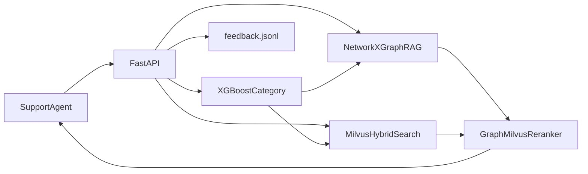
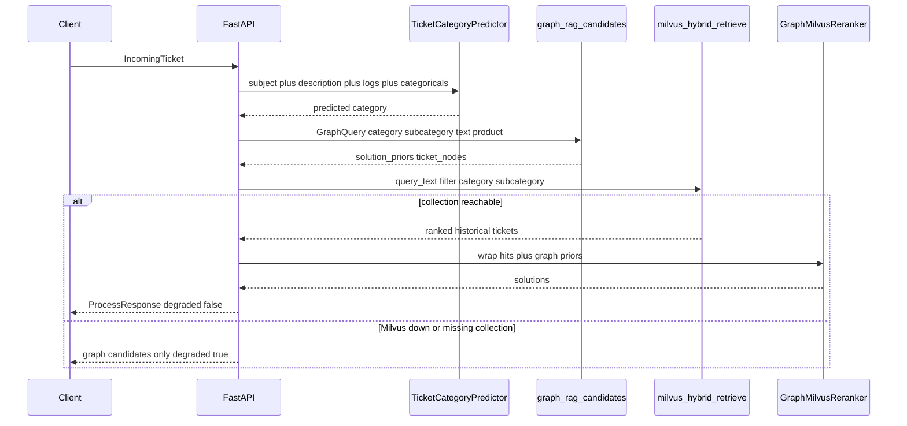
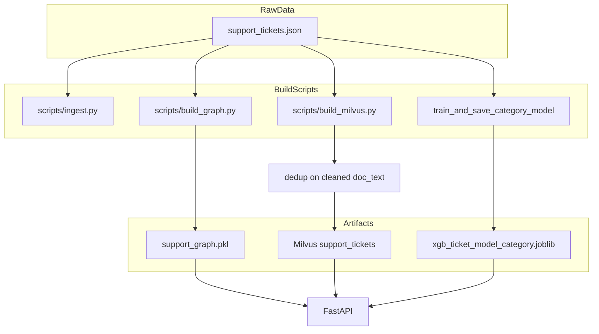
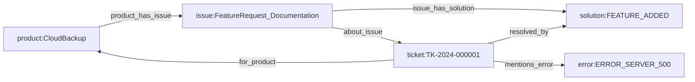
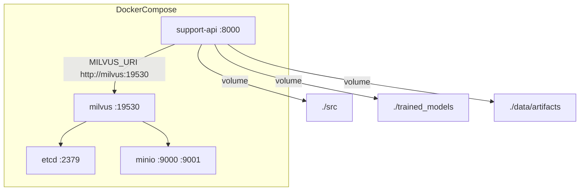
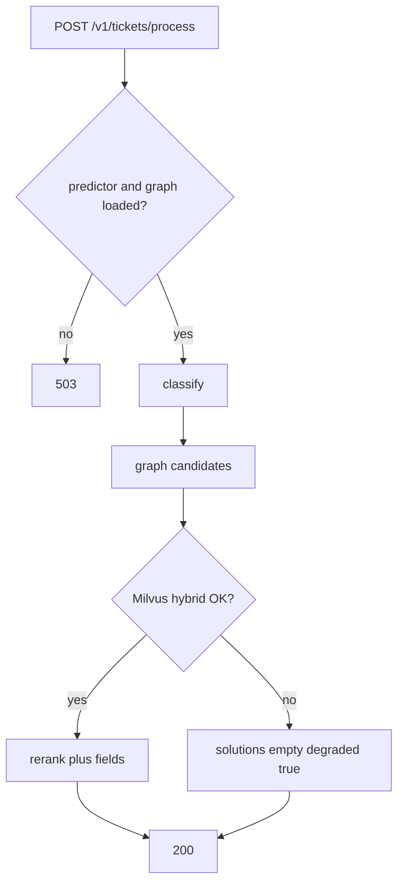

# Architecture

This document describes the Intelligent Product Support System as implemented: how components are wired, why they were chosen, and how the stack is deployed. It is the architecture deliverable for the assessment; setup and API samples live in [README.md](README.md).

## 1. System context

Agents (or a UI) submit an incoming ticket. The system **classifies** it, **retrieves** similar historical resolutions, and **reranks** them using graph priors (how often a resolution actually helped for this issue type). Feedback is recorded for later training; models are not retrained in the request path.



**What is in scope today**

| Layer | Implementation |
|-------|----------------|
| Ingest | JSON tickets via `scripts/ingest.py` → Pydantic `Ticket` |
| Classify | TF-IDF + XGBoost category model |
| Graph-RAG | NetworkX: Product ↔ Issue ↔ Solution ↔ Ticket (+ error codes) |
| Vector RAG | Milvus hybrid search (MiniLM dense + BM25 sparse) |
| Serve | FastAPI, Docker Compose |
| Feedback | Append-only JSONL |

**Explicitly not built yet** (assessment items left as follow-on): TensorFlow/CatBoost comparison, subcategory models on disk, anomaly detection, experiment tracking (MLflow), automatic retraining from feedback.

## 2. Runtime request path

Primary endpoint: `POST /v1/tickets/process`.



### Component hand-off (they build on each other)

1. **Categorization** produces `category`. That value is the metadata filter for Milvus (`category == "..."`) and, with optional `subcategory`, the graph issue node `issue:{category}|{subcategory}`.
2. **Graph-RAG** walks issue→solution edges (`helpful_rate`, `count`) and error-code→ticket→solution paths. Output is priors, not full ticket text.
3. **Milvus** does hybrid retrieval (semantic + keyword) constrained by the predicted category.
4. **Reranker** fuses both: normalized Milvus score, graph prior on `resolution_code`, `resolution_helpful`, and category match.

Score (defaults in `RerankWeights`):

```
final = 1.0 * milvus_norm + 0.5 * graph_prior + 0.1 * helpful + 0.1 * same_category
```

If Milvus is already filtered by category, `same_category` is nearly constant across hits; `graph_prior` and `helpful` are the main non-vector signals.

### API surface

| Method | Path | Depends on | Failure mode |
|--------|------|------------|----------------|
| GET | `/health` | process | always 200 if up |
| GET | `/ready` | model + graph + Milvus `list_collections` | 503 if any missing |
| POST | `/v1/tickets/classify` | XGBoost | 503 if model missing |
| POST | `/v1/tickets/solutions` | graph; model only if `category` omitted | graph-only if Milvus fails |
| POST | `/v1/tickets/process` | model + graph | 503 without model/graph; `degraded` without Milvus |
| POST | `/v1/feedback` | filesystem | append JSONL, no retrain |

Inbound tickets use `IncomingTicket` (subject, description, logs, product metadata). They are **not** the historical `Ticket` schema, which requires resolved-ticket fields (`ticket_id`, gold `category`, timestamps).

Startup loads artifacts **once** (lifespan): XGBoost joblib bundle, `support_graph.pkl`, MiniLM embedder, Milvus client. XGBoost is unpickled **before** importing `sentence-transformers` to avoid an OpenMP crash.

## 3. Offline / batch pipelines

Serving never reads the 110k JSON file. Indexes are built by CLI scripts, then mounted or pointed at by the API.



| Script | Input | Output | Dedup? |
|--------|--------|--------|--------|
| `scripts/ingest.py` | JSON | valid/invalid + duplicate stats | no (report only) |
| `scripts/build_graph.py` | full 110k tickets | `data/artifacts/support_graph.pkl` | **no** — priors need full counts |
| `scripts/build_milvus.py` | same JSON | Milvus collection | **yes** — cleaned `doc_text`, keep helpful + high satisfaction |
| training | sample / full JSON | `trained_models/xgb_ticket_model_category.joblib` | class imbalance via XGBoost / split in `feature_builder` |

Measured duplication: 110,000 rows, all unique `ticket_id`, but only ~1,950 unique cleaned documents. Indexing templates once avoids polluting hybrid search.

## 4. Graph model

Undirected NetworkX graph built in `src/data/graph_rag_ingest.py`.



| Node | ID pattern | Role at query time |
|------|------------|--------------------|
| Product | `product:{name}` | optional context |
| Issue | `issue:{category}\|{subcategory}` | entry for solution priors and citations |
| Solution | `solution:{resolution_code}` | prior = `0.7 * helpful_rate + 0.3 * log1p(count)/5` |
| Ticket | `ticket:{ticket_id}` | citation list (capped) |
| Error | `error:{ERROR_*}` | precision boost via error→ticket→solution |

Without a subcategory hint, issue-level priors are skipped; error-code paths and Milvus category filter still run.

## 5. Hybrid retrieval (Milvus)

Collection `support_tickets`:

- **Dense:** `all-MiniLM-L6-v2` (384-d, IP / HNSW)
- **Sparse:** BM25 on `doc_text` (analyzer `english`)
- **Fusion:** `RRFRanker` over both
- **Filter:** escaped `category` / `subcategory` / optional ticket-id list
- **Payload:** `ticket_id`, `doc_text`, `category`, `subcategory`, `product`, `product_module`, `resolution_code`, `resolution_helpful`

API responses split `doc_text` back into `subject`, `description`, `error_logs` (`split_doc_text`).

## 6. Deployment



- **Reproducibility:** `uv.lock` + Hatch package `src`; image built from `Dockerfile` (`uv sync --frozen`).
- **Local vs Docker:** `uvicorn` on the host uses `http://127.0.0.1:19530`; the API container uses `http://milvus:19530`.
- **Volumes:** graph pickle and model are **not** rebuilt in the container entrypoint. `./src` is mounted so API code can change without a PyTorch image rebuild.
- **Isolation:** etcd/MinIO/Milvus are this compose project; host ports 8000 / 9000 / 9091 collide with other stacks if those are running.

## 7. Technology choices

| Choice | Why | Trade-off |
|--------|-----|-----------|
| FastAPI | Typed OpenAPI, TestClient, lifespan for heavy artifacts | Sync handlers; classify/retrieve block the worker |
| XGBoost + TF-IDF | Fast CPU inference, matches >85% F1 target on this synthetic set | No deep model in serving; MiniLM used only for retrieval |
| NetworkX pickle | Fits 110k tickets in-process; simple issue→solution stats | Not a clustered graph DB; reload on process start |
| Milvus hybrid | Category filter + dense + BM25 in one engine | Extra infra (etcd, MinIO); empty collection looks “ready” until indexed |
| Dedup only for vectors | Graph counts stay honest; search index stays unique | Indexed row is a representative, not every `ticket_id` |
| JSONL feedback | Honest “capture corrections” without fake MLOps | No closed-loop training yet |
| Docker Compose | Assessment: containerized, same layout on any machine | GPU not used; MiniLM on CPU at startup (~seconds) |

## 8. Resilience



- Model or graph missing → **503** (cannot do the foundation layer).
- Milvus down or collection missing → **200** with `degraded: true` and graph `solution_nodes` / `ticket_nodes`.
- Filter strings are escaped so client `subcategory` cannot break the Milvus expression.

## 9. Repository map

```
src/api/           FastAPI app, schemas, pipeline, lifespan state
src/classification XGBoost train / load / predict
src/data/          ingest, transforms, graph build + query
src/rag/           Milvus store, hybrid retrieve, reranker
src/config.py      pydantic-settings
scripts/           ingest, build_graph, build_milvus
trained_models/    category joblib bundle
data/artifacts/    support_graph.pkl, feedback.jsonl
```

## 10. Production follow-ons

- `/ready` should require collection `support_tickets` to exist, not only connectivity.
- Persist resolutions (not only `resolution_code`) if agents need the full fix text in the payload.
- Subcategory model, or product filter in Milvus, to reduce cross-product near-duplicates.
- Streaming ingest and drift/anomaly jobs on classify + retrieve-failure logs.
- MLflow (or equivalent) for the XGBoost vs TF comparison the brief asks for.
